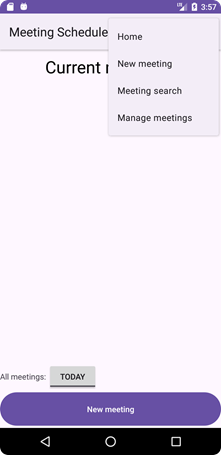
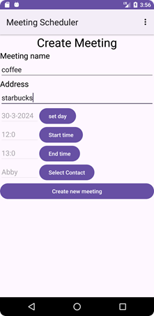

<html>

<head>
<meta http-equiv=Content-Type content="text/html; charset=utf-8">
<meta name=Generator content="Microsoft Word 15 (filtered)">

</head>

<body bgcolor=white lang=EN-US style='word-wrap:break-word'>

COSC 3P97 A2 Meeting
Scheduler

Nicholas parise 7242530

March 27, 2024

&nbsp;

-&nbsp;&nbsp;&nbsp;&nbsp;&nbsp;&nbsp; When
launching the app the first time you will be asked for contact permissions
select yes.

-&nbsp;&nbsp;&nbsp;&nbsp;&nbsp;&nbsp; At
first you will have nothing showing up on the main screen, as you have not
created any meetings yet. 

<table class=1 border=1 cellspacing=0 cellpadding=0 width=732 style='margin-left:
 -40.5pt;border-collapse:collapse;border:none'>
 <tr>
  <td width=244 valign=top style='width:183.0pt;border:solid black 1.0pt;
  padding:5.0pt 5.0pt 5.0pt 5.0pt'>
  
To create a meeting click “New meeting’ at the button or
  “New meeting” on the menu bar.

  
the toggle switch is used to change which day you want to
  see meetings from

  </td>
  <td width=244 valign=top style='width:183.0pt;border:solid black 1.0pt;
  border-left:none;padding:5.0pt 5.0pt 5.0pt 5.0pt'>
  
To create a meeting
  simply fill out the screen, clicking the buttons to launch the time and date
  widgets along with the contact selector

  </td>
  <td width=244 valign=top style='width:183.0pt;border:solid black 1.0pt;
  border-left:none;padding:5.0pt 5.0pt 5.0pt 5.0pt'>
  
If you want to search which contacts are in the meeting
  simply go through the menu to: “meeting search”. Here you can select a
  contact with the button and see all the meetings that the contact is in

  </td>
 </tr>
 <tr>
  <td width=244 valign=top style='width:183.0pt;border:solid black 1.0pt;
  border-top:none;padding:5.0pt 5.0pt 5.0pt 5.0pt'>
  

  </td>
  <td width=244 valign=top style='width:183.0pt;border-top:none;border-left:
  none;border-bottom:solid black 1.0pt;border-right:solid black 1.0pt;
  padding:5.0pt 5.0pt 5.0pt 5.0pt'>
  

  
&nbsp;

  </td>
  <td width=244 valign=top style='width:183.0pt;border-top:none;border-left:
  none;border-bottom:solid black 1.0pt;border-right:solid black 1.0pt;
  padding:5.0pt 5.0pt 5.0pt 5.0pt'>
  

  </td>
 </tr>
 <tr>
  <td width=244 valign=top style='width:183.0pt;border:solid black 1.0pt;
  border-top:none;padding:5.0pt 5.0pt 5.0pt 5.0pt'>
  
&nbsp;

  
&nbsp;

  
&nbsp;

  </td>
  <td width=244 valign=top style='width:183.0pt;border-top:none;border-left:
  none;border-bottom:solid black 1.0pt;border-right:solid black 1.0pt;
  padding:5.0pt 5.0pt 5.0pt 5.0pt'>
  
&nbsp;

  </td>
  <td width=244 valign=top style='width:183.0pt;border-top:none;border-left:
  none;border-bottom:solid black 1.0pt;border-right:solid black 1.0pt;
  padding:5.0pt 5.0pt 5.0pt 5.0pt'>
  
&nbsp;

  </td>
 </tr>
 <tr>
  <td width=244 valign=top style='width:183.0pt;border:solid black 1.0pt;
  border-top:none;padding:5.0pt 5.0pt 5.0pt 5.0pt'>
  
If you want to view a meeting more closely you can simply
  press and hold on one of items in a listview to open a menu

  </td>
  <td width=244 valign=top style='width:183.0pt;border-top:none;border-left:
  none;border-bottom:solid black 1.0pt;border-right:solid black 1.0pt;
  padding:5.0pt 5.0pt 5.0pt 5.0pt'>
  
If you want to
  manage the meetings you can simply go to the meeting manager under the menu.
  Each button is labelled and does its function immediately 

  <ol style='margin-top:0in' start=1 type=1>
   <li class=MsoNormal style='line-height:normal;border:none'>Pushed meetings
       will push all of today's meetings to tomorrow</li>
   <li class=MsoNormal style='line-height:normal;border:none'>Clear today, will
       delete all meetings today</li>
   <li class=MsoNormal style='line-height:normal;border:none'>Clear all, will
       delete all of the meetings</li>
  </ol>
  </td>
  <td width=244 valign=top style='width:183.0pt;border-top:none;border-left:
  none;border-bottom:solid black 1.0pt;border-right:solid black 1.0pt;
  padding:5.0pt 5.0pt 5.0pt 5.0pt'>
  
&nbsp;

  </td>
 </tr>
 <tr>
  <td width=244 valign=top style='width:183.0pt;border:solid black 1.0pt;
  border-top:none;padding:5.0pt 5.0pt 5.0pt 5.0pt'>
  

  </td>
  <td width=244 valign=top style='width:183.0pt;border-top:none;border-left:
  none;border-bottom:solid black 1.0pt;border-right:solid black 1.0pt;
  padding:5.0pt 5.0pt 5.0pt 5.0pt'>
  

  </td>
  <td width=244 valign=top style='width:183.0pt;border-top:none;border-left:
  none;border-bottom:solid black 1.0pt;border-right:solid black 1.0pt;
  padding:5.0pt 5.0pt 5.0pt 5.0pt'>
  
&nbsp;

  </td>
 </tr>
</table>

&nbsp;

&nbsp;

&nbsp;

</body>

</html>
